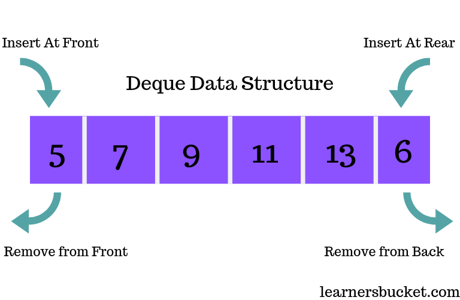

# Deque
> Two-way line
## Description
- Deque is a line where the waiters can leave the line from the front end and the back end. It is a combination of the Stack and the Queue data structure.
## Definition
- In C++, a deque (double-ended queue) is a data structure that represents a sequence of elements, similar to a vector or list. The term "double-ended" refers to the ability to insert and remove elements from both ends of the deque.

- A deque supports efficient insertion and deletion operations at both the front and the back of the container. It allows constant time complexity O(1) for these operations, unlike a vector which provides efficient insertion and deletion only at the end.


## How to use
- Some of the functions that you can use with the Deque data structure are:
```c++
.push_back(value); // Insert an element at the end of the deque
.push_front(value); // Insert an element at the beginning of the deque

.pop_back(); // Remove the last element from the deque
.pop_front(); // Remove the first element from the deque

.front(); // Access the first element of the deque
.back(); // Access the last element of the deque

.empty(); // Check if the deque is empty
.size(); // Get the number of elements in the deque

```


## Example
- Here is an example of Deque in C++ so that you can better understand it:
```c++
#include <iostream>
#include <deque>

int main() {
    std::deque<int> dequeNum; // Declaration of a deque of integers

    // Inserting elements at the back of the deque
    dequeNum.push_back(10);
    dequeNum.push_back(20);
    dequeNum.push_back(30);

    // Inserting elements at the front of the deque
    dequeNum.push_front(5);
    dequeNum.push_front(2);

    // Accessing elements
    std::cout << "Front element: " << dequeNum.front() << std::endl; // Output: 2
    std::cout << "Back element: " << dequeNum.back() << std::endl; // Output: 30

    // Removing elements from the front and back
    dequeNum.pop_front();
    dequeNum.pop_back();

    // Displaying the elements in the deque
    std::cout << "Deque elements: ";
    for (const auto& num : dequeNum) {
        std::cout << num << " ";
    }
    std::cout << std::endl; // Output: Deque elements: 5 10 20

    // Checking if the deque is empty
    bool isEmpty = dequeNum.empty();
    std::cout << "Is deque empty? " << (isEmpty ? "Yes" : "No") << std::endl; // Output: No

    // Getting the size of the deque
    std::cout << "Deque size: " << dequeNum.size() << std::endl; // Output: Deque size: 3

    return 0;
}

```
## Some Problems
- In this same folder, I have added anothger folder dedicated to solving some examplary deque-related problems with my own editorials. You can go check it out.
## Authors
- Huynh Khac Tam: [hkt456](https://github.com/hkt456)
- Huynh Gia Bao: [doctorbingchilling](https://github.com/doctorbingchilling)
