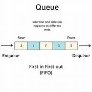

# Queue
> Literally a line
## Description
- Again, it is just a line. Imagine having to get into a line for the bathroom at a concert. You have to get into a queue for that. That's our queue. 
## Definition
- In C++, a queue is a data structure that follows the First-In-First-Out (FIFO) principle. It represents a collection of elements where the element added first is the one that is removed first. 
- The operations on a queue are performed at both ends, with elements being added at one end (called the rear) and removed from the other end (called the front). Each operation with the Queue data structure has the time complexity of O(1).


## How to use
- Some of the functions that you can use with the Queue data structure are:
```c++
.push(x) //Adds an element to the rear (end) of the queue
.pop() //Removes the element from the front of the queue
.front() //Accesses the element at the front of the queue without removing it
.back() //Accesses the element at the rear of the queue without removing it
.empty() //Checks if the queue is empty or not
.size() // Returns the number of elements in the queue.
```


## Example
- Here is an example of Queue in C++ so that you can better understand it:
```c++
#include <iostream>
#include <queue>
int main() {
    std::queue<int> myQueue; // Declaration of a queue of integers

    // Enqueue elements to the queue
    myQueue.push(10);
    myQueue.push(20);
    myQueue.push(30);

    // Accessing and printing the front element
    std::cout << "Front element: " << myQueue.front() << std::endl; // Output: 10

    // Dequeue (remove) the front element
    myQueue.pop();

    // Enqueue another element
    myQueue.push(40);

    // Printing the elements in the queue
    std::cout << "Queue elements: ";
    while (!myQueue.empty()) {
        std::cout << myQueue.front() << " ";
        myQueue.pop();
    }
    std::cout << std::endl; // Output: Queue elements: 20 30 40

    return 0;
}

```
## Some Problems
- In this same folder, I have added anothger folder dedicated to solving some examplary queue-related problems with my own editorials. You can go check it out.
## Authors
- Huynh Khac Tam: [hkt456](https://github.com/hkt456)
- Huynh Gia Bao: [doctorbingchilling](https://github.com/doctorbingchilling)
